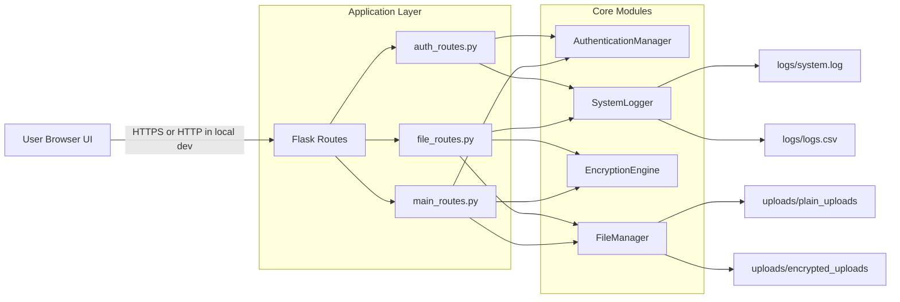
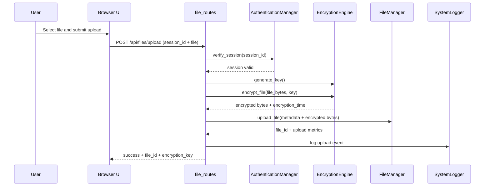
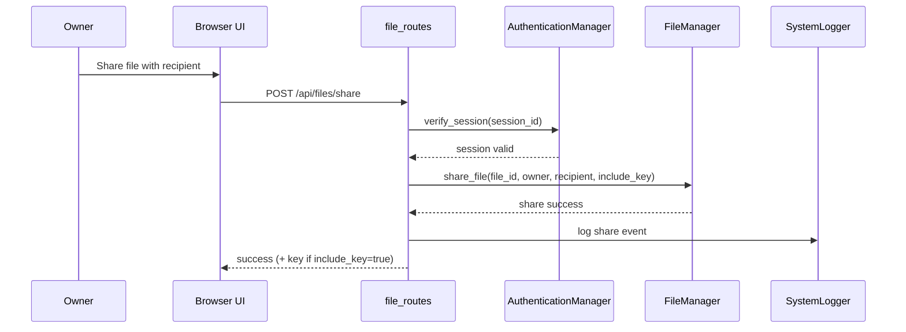
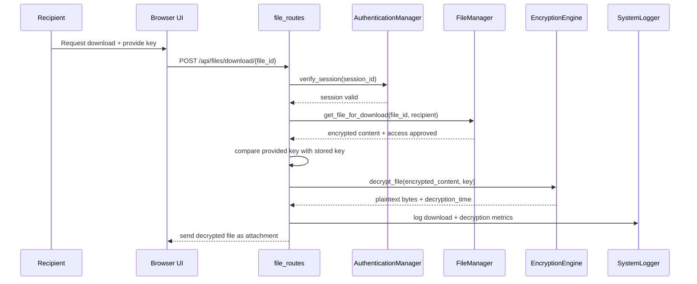

# Week 4 System Design Specification

## Objective

Finalize system architecture, component interactions, secure data flow, and trust boundaries for the Secure File Transfer System.

## Scope of Week 4

This document completes Week 4 deliverables from the proposal:

- Final architecture and component map
- Route-to-component mapping
- Upload/share/download sequence design
- Trust boundaries and attack surface notes

## Final Architecture

## Route to Component Mapping

| API Route                          | Route File     | Primary Module(s)              | Security Controls                           |
| ---------------------------------- | -------------- | ------------------------------ | ------------------------------------------- |
| POST /api/auth/register            | auth_routes.py | AuthenticationManager          | Input validation, password hashing          |
| POST /api/auth/login               | auth_routes.py | AuthenticationManager          | Credential verification, session creation   |
| POST /api/auth/logout              | auth_routes.py | AuthenticationManager          | Session invalidation                        |
| POST /api/auth/verify              | auth_routes.py | AuthenticationManager          | Session validation                          |
| GET /api/auth/users                | auth_routes.py | AuthenticationManager          | User list retrieval                         |
| GET /api/auth/stats                | auth_routes.py | AuthenticationManager          | Auth metrics reporting                      |
| POST /api/files/upload             | file_routes.py | EncryptionEngine, FileManager  | Session check, encryption before storage    |
| POST /api/files/share              | file_routes.py | FileManager                    | Ownership check, recipient access control   |
| POST /api/files/download/<file_id> | file_routes.py | FileManager, EncryptionEngine  | Session check, access check, key validation |
| POST /api/files/my-files           | file_routes.py | FileManager                    | Session check, owner scoping                |
| POST /api/files/shared-with-me     | file_routes.py | FileManager                    | Session check, recipient scoping            |
| POST /api/files/delete/<file_id>   | file_routes.py | FileManager                    | Owner-only delete authorization             |
| POST /api/files/unshare            | file_routes.py | FileManager                    | Owner-only share revocation                 |
| GET /api/files/stats               | file_routes.py | FileManager                    | Stats retrieval                             |
| GET /                              | main_routes.py | Flask template layer           | UI delivery                                 |
| GET /api/system/stats              | main_routes.py | Auth, File, Encryption modules | Aggregated stats endpoint                   |

## Sequence Designs

### 1) Upload and Encrypt

### 2) Share with Recipient

### 3) Download, Verify Access, Decrypt

## Trust Boundaries

1. Client to Server boundary

- Boundary: Browser to Flask routes
- Required controls: TLS in deployment, request validation, session verification

2. Route to Core Module boundary

- Boundary: External input enters business logic
- Required controls: input sanitization, strict authorization checks before file operations

3. Storage boundary

- Boundary: filesystem writes to uploads and logs
- Required controls: safe file naming, path controls, access permissions, encrypted-at-rest files

4. Secret handling boundary

- Boundary: encryption keys and session IDs
- Required controls: do not write clear keys to long-term logs, controlled sharing behavior

## Attack Surface and Controls

| Threat                | Exposure Point           | Existing Control                               | Week 5+ Improvement                       |
| --------------------- | ------------------------ | ---------------------------------------------- | ----------------------------------------- |
| Unauthorized download | /api/files/download      | session check + share access check + key check | add lockout/rate limiting                 |
| Credential attacks    | /api/auth/login          | hashed passwords + failed attempt tracking     | stronger backoff/lockout policy           |
| Data interception     | network path             | encrypted file payload handling                | enforce HTTPS/TLS end-to-end              |
| File tampering        | encrypted upload storage | Fernet authenticated encryption check          | integrity alerting/reporting              |
| Path abuse            | file upload names        | filename sanitization                          | add stricter extension and content checks |

## Week 4 Completion Evidence

- Architecture finalized with module boundaries
- Route-to-component mapping documented
- Upload/share/download sequence flows documented
- Trust boundaries and attack surface documented

Status: Week 4 design deliverable implemented.
